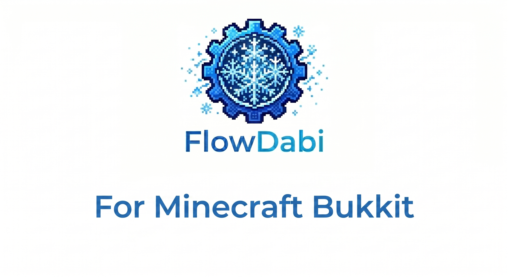

# # flowdabi

**flowdabi**는 Go 언어(Golang)의 압도적인 성능을 위한 마인크래프트 서버 버킷 개발. 물론, 플러그인 리로드가 목적.

[특징](https://www.google.com/search?q=%23-key-features) • [시작하기](https://www.google.com/search?q=%23-getting-started) • [예제 코드](https://www.google.com/search?q=%23-quick-start) • [기여하기](https://www.google.com/search?q=%23-contributing)

<div align="center">



### 🚀 Go-powered Minecraft 


---

## 🚀 Key Features

* **High Performance**: JVM의 가비지 컬렉션(GC) 스트레스로부터 자유로우며, 고루틴을 활용해 대규모 비동기 연산을 가볍게 처리합니다.
* **Modern Language Developer Experience**: Java의 장황한 보일러플레이트 코드에서 벗어나, Go 특유의 간결하고 직관적인 문법으로 서버 로직을 작성할 수 있습니다.
* **Folia-First Architecture**: 멀티스레드 기반 분산 마인크래프트 서버인 Folia 환경에 최적화되어 설계되었습니다.
* **Lightweight & Fast Build**: 수 초 내에 끝나는 컴파일 속도로 피드백 루프를 극도로 단축시킵니다.

---

## 🛠 Getting Started

### Prerequisites

* **Go**: `1.22` 이상
* **마인크래프트 서버 환경**: Folia (1.21.x 권장)

### Installation

```bash
go get github.com/yourusername/flowdabi

```

---

## 💻 Quick Start

`flowdabi`를 사용해 서버에 플레이어가 접속할 때 환영 메시지를 보내고, `/heal` 명령어를 처리하는 간단한 예제입니다.

```go
package main

import (
	"fmt"
	"github.com/yourusername/flowdabi/bukkit"
	"github.com/yourusername/flowdabi/event"
)

func main() {
	// 플러그인 로드 시 초기화
	bukkit.OnEnable(func() {
		fmt.Println("[flowdabi] 플러그인이 성공적으로 활성화되었습니다!")

		// 1. 이벤트 리스너 등록 (플레이어 접속)
		bukkit.RegisterEvent(event.PlayerJoin, func(e *event.PlayerJoinEvent) {
			player := e.GetPlayer()
			player.SendMessage("§aflowdabi 서버에 오신 것을 환영합니다! 🚀")
		})

		// 2. 커맨드 등록 (/heal)
		bukkit.RegisterCommand("heal", func(sender bukkit.CommandSender, args []string) bool {
			player, ok := sender.ToPlayer()
			if !ok {
				sender.SendMessage("플레이어만 사용할 수 있는 명령어입니다.")
				return true
			}
			
			player.SetHealth(20.0)
			player.SetFoodLevel(20)
			player.SendMessage("§e체력과 허기 수치가 모두 회복되었습니다.")
			return true
		})
	})

	bukkit.OnDisable(func() {
		fmt.Println("[flowdabi] 플러그인이 비활성화되었습니다.")
	})
}

```

---

## 🗺 Roadmap

* [ ] **Folia 최적화**: Folia 옥트리 구조(Region-based) 스케줄러와 Go 고루틴 스케줄러 간의 스레드 안전(Thread-safe) 동기화 안정화
* [ ] **경량 월드 관리**: 디스크 I/O 최적화를 위한 `zlib` 기반 고성능/경량 월드 맵 데이터 포매팅 및 고속 로더 구현

---

## 📄 License

이 프로젝트는 **MIT 라이선스**에 따라 자유롭게 수정, 배포, 상업적 이용이 가능합니다. 자세한 내용은 [LICENSE](https://www.google.com/search?q=./LICENSE) 파일을 참조하세요.

```
MIT License

Copyright (c) 2026 flowdabi

Permission is hereby granted, free of charge, to any person obtaining a copy
of this software and associated documentation files (the "Software"), to deal
in the Software without restriction, including without limitation the rights
to use, copy, modify, merge, publish, distribute, sublicense, and/or sell
copies of the Software, and to permit persons to whom the Software is
furnished to do so, subject to the following conditions:
...

```

---

**flowdabi** 프로젝트는 마인크래프트 서버 개발 생태계에 새로운 흐름을 만들고자 합니다. 여러분의 스타(⭐)와 Pull Request는 프로젝트 성장에 큰 힘이 됩니다!
